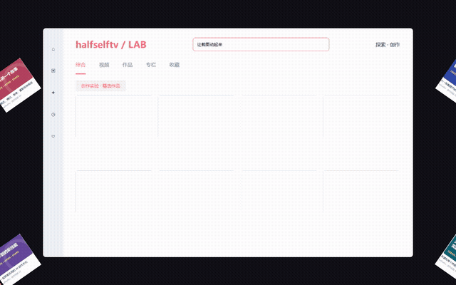

# 图片冲击动效 · Screenshot Impact Video

**给 Codex 一张截图或照片，把静态画面变成动态视频。**

卡片爆开与重组、文字冲屏、图标失重环绕，以及推近、横扫、倾斜和穿越镜头。由 AI 根据截图结构编排，输出 MP4 和可修改源码。

来自 **halfselftv** 的截图动效实验。



[播放带音效的完整演示](demo.mp4) · [查看演示原图](demo-source.png)

## 这是什么

这是一个给 Codex 使用的 **Skill + 动效模板 + 项目创建工具**。你在对话里提供截图和要求，Codex 分析画面、调整图层与时间线、检查并渲染视频。

当前包含以下制作路径，调用名仍为 `$screenshot-impact-video`：

| 截图结构 | 可使用的动效 |
| --- | --- |
| 内容卡片、搜索结果、缩略图列表 | 爆开重组、标题冲屏、多方向甩入、镜头急停 |
| 桌面、应用图标、分散的小元素 | 失重散开、空间环绕、近景穿越、散射归位 |
| 实物照片 | 可配置镜头、人工选区悬浮、局部背景补片和光效；已有试验样片 |
| 宠物、风景、大海 | 提供处理路线和检查规则；自然动作需另外的图生视频能力与实测 |

它仍需要 Codex 为新截图调整选区和编排。安装后不会出现独立的拖拽应用，也不附带自动抠图服务。

## 安装

完整包包含 Skill、全部源码、安装器、测试和演示素材；下面的命令均在完整包解压后的目录执行。仓库首页提供演示和整包下载。

点击 **[下载 Skill 完整包](screenshot-impact-video.zip?raw=true)**，解压后，在 `screenshot-impact-video` 目录打开终端运行：

```sh
python scripts/install.py
```

Windows 如果 `python` 命令不可用可试 `py`；macOS/Linux 可用 `python3`。安装器默认放入 `$CODEX_HOME/skills`，未设置时使用 `~/.codex/skills`；已存在同名 Skill 时会停止，不覆盖你的修改。

也可以手动复制 `skills/screenshot-impact-video` 整个文件夹到上述 Skill 目录。

## 使用

在 Codex 中附上一张 PNG/JPEG 截图或照片，然后发送：

> 使用 $screenshot-impact-video，把这张截图做成一段有冲击力的视频。动效不规则，镜头可以推近、倾斜和穿越，带音效。

也可以提出具体要求：

> 做成 15 秒竖屏，重点展示中间三张卡片，开头快速抓住注意力，最后回到原图。

如果安装后列表未出现 Skill，刷新技能列表或重新打开 Codex。当前主要验证环境为 Windows + Codex；其他支持 Skill 的代理工具可能需要调整安装目录和渲染命令。

## 环境要求

- 可读取图片、运行本地代码的 Codex 环境。
- Python 3.10+：项目创建、模板构建和合成音效使用标准库。
- Node.js 22+ 和 npm：安装 HyperFrames 与 GSAP。
- 渲染环境需要 Chrome/Chromium、FFmpeg，按 HyperFrames 的诊断提示准备。
- 首次安装 npm 依赖需要网络；使用 Codex 的费用、账号或额度由使用者自行提供。这个仓库不包含 API 密钥。

安装 Skill 本身不会安装全部视频运行时。首次制作时，Codex 应检查环境、准备项目依赖，并报告缺少的组件。

## 代理的项目流程

Skill 包内提供 `scripts/scaffold.py`。它创建可编辑项目并读取原图尺寸，不会猜测图层坐标：

```sh
python skills/screenshot-impact-video/scripts/scaffold.py --source screenshot.png --output output/demo --template cards
```

使用 `icons` 选择图标模板。随后由 Codex 根据新截图调整生成的 `build.py`，再在生成项目目录中执行：

```sh
npm install
npm run doctor
python build.py
npm run check
npm run render
```

照片通用模板可以直接配置镜头、强度、时长、帧率和声音：

```sh
python skills/screenshot-impact-video/scripts/scaffold.py --source photo.jpg --output output/photo-demo --template photo --intensity strong --camera dynamic --duration 18 --fps 30
```

强度可选 `subtle / balanced / strong`，镜头可选 `static / cinematic / dynamic`；加 `--no-sound` 输出静音视频。在生成项目的 motion-plan.json 中编辑输出尺寸、图层选区、位移、旋转、背景补片和光效。**没有定义图层时只做镜头运动**；局部物体悬浮仍需要代理选区。详见[照片配置](photo-plan.md)。

这些参数由 photo 构建器实际读取；cards/icons 仍需要在专用 build.py 中编排。创建器会识别 JPEG 的 EXIF 方向，要求先处理旋转后再定义照片坐标。

项目使用固定的直接依赖版本 HyperFrames 0.8.34 和 GSAP 3.14.2。npm 会生成 package-lock.json，请随项目保留，以固定后续依赖解析结果。

`npm run doctor` 检查渲染依赖。若无法找到本机浏览器或媒体工具，可按 HyperFrames 提示设置 `HYPERFRAMES_BROWSER_PATH`、`HYPERFRAMES_FFMPEG_PATH` 和 `HYPERFRAMES_FFPROBE_PATH`，值使用你电脑上的实际可执行文件路径。

想先复现公开演示，可把上面的 source 改成 `examples/demo-source.png` 并选择 `cards`；这张演示原图与卡片模板坐标匹配，可以直接构建。仓库示例页为专门制作的虚构页面。

## 当前限制

- 卡片和图标构建器包含示例专用坐标；照片模板可配置，但不自动提取主体。
- 小狗转头、海浪翻涌等自然动作不包含在当前本地渲染器里，需要额外可用工具并逐项验证。
- 裁切图层可能带有原背景；复杂背景修复不是本版本的自动能力。
- 低分辨率截图中的小字和图标放大后会模糊。
- 字体和浏览器环境不同可能导致画面差异；每次应检查实际渲染。
- 默认在本地处理和渲染素材；你使用的 AI 服务是否接收截图，取决于代理本身的工作方式。

## 反馈

欢迎在 Issues 分享截图类型、希望的动作和遇到的问题。提交截图或日志前请先去除私人信息。

关注 **halfselftv**，一起学习和尝试 AI 创作。

## 依赖

- [HyperFrames](https://github.com/heygen-com/hyperframes)：HTML 视频合成与导出。
- [GSAP](https://gsap.com/docs/v3/Installation/)：时间线与动画。

依赖由 npm 安装，遵循各自许可；仓库不打包第三方运行库。当前仓库尚未附带开源许可证。
